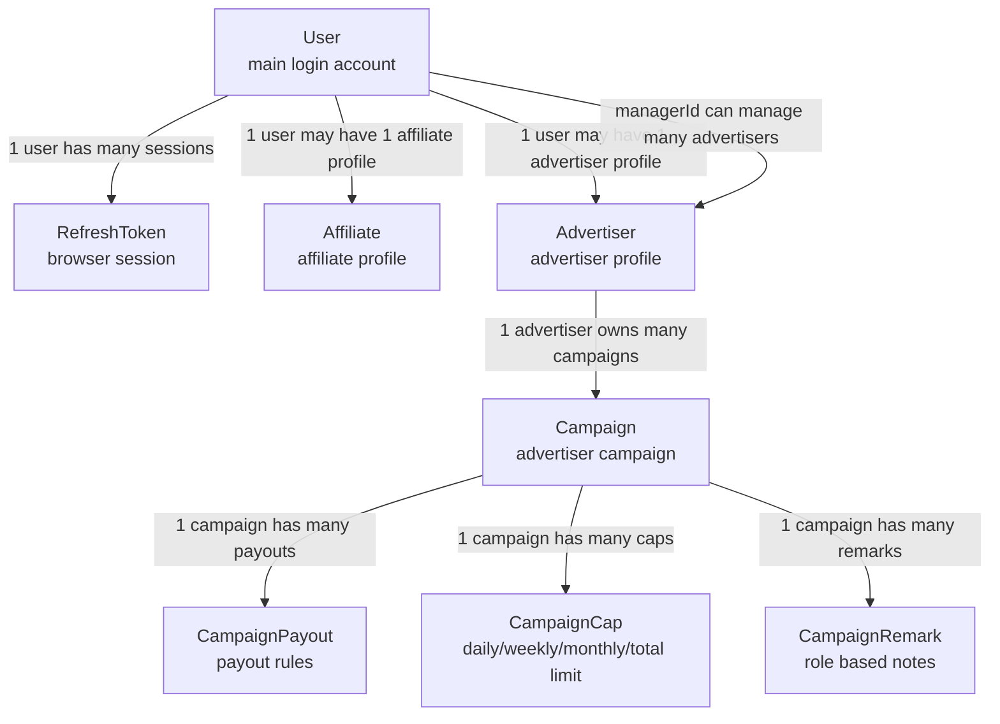
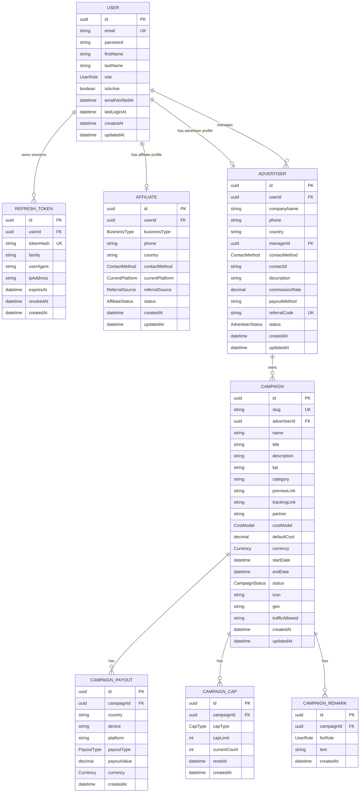
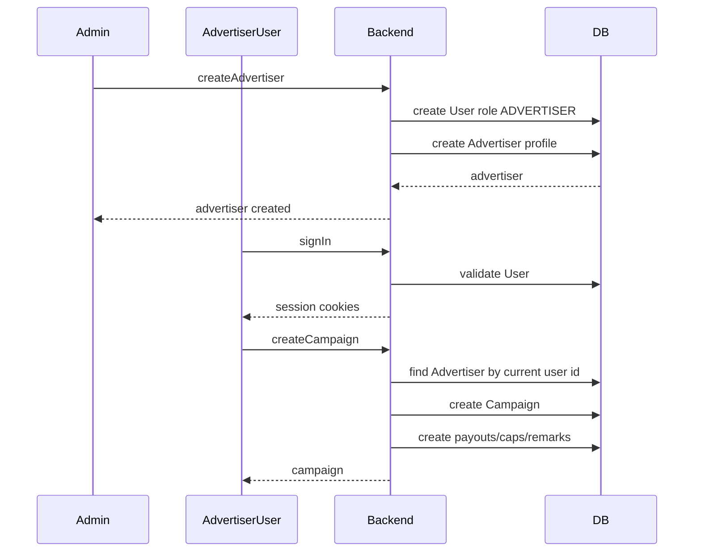
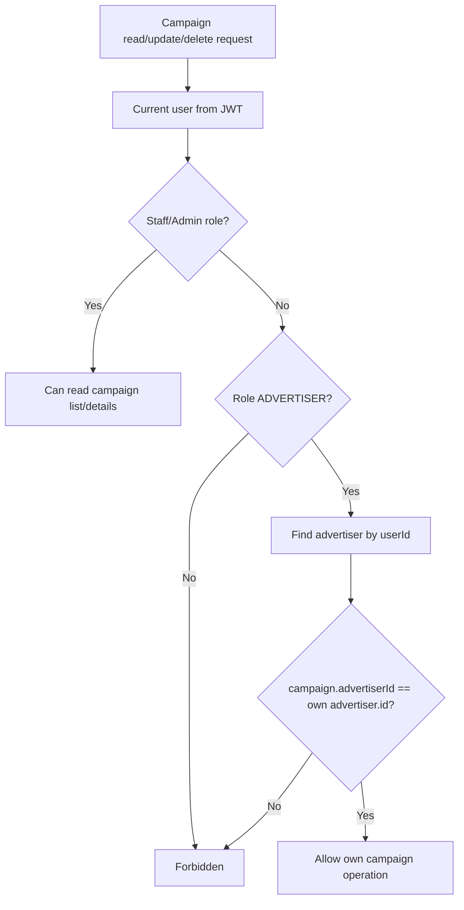
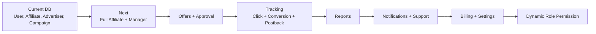

# Database UML Diagram

Ei file ta backend database design bujhar jonno. Current Prisma schema theke je table/model already ache, segula first section e deya holo. Future scope alada section e rakha holo, karon oi table gula ekhono code e fully implemented na.

## Current Database Overview

Current database core idea:

- `User` holo main account table.
- Ekjon user affiliate profile pete pare.
- Ekjon user advertiser profile pete pare.
- Admin/manager user advertisers manage korte pare.
- Advertiser campaign create kore.
- Campaign er nested payout, cap, remark thake.
- Refresh token table login/session rotation handle kore.

## Current ER Diagram

## Table By Table Details

### User

Purpose: login account and role identity.

| Column            | Type              | Rule                                     |
| ----------------- | ----------------- | ---------------------------------------- |
| `id`              | UUID              | Primary key                              |
| `email`           | String            | Unique                                   |
| `password`        | String            | Hashed password, never expose in GraphQL |
| `firstName`       | String            | Required                                 |
| `lastName`        | String            | Required                                 |
| `role`            | `UserRole`        | Default `AFFILIATE`                      |
| `isActive`        | Boolean           | Default true                             |
| `emailVerifiedAt` | DateTime nullable | Optional verification time               |
| `lastLoginAt`     | DateTime nullable | Updated after sign in                    |
| `createdAt`       | DateTime          | Auto                                     |
| `updatedAt`       | DateTime          | Auto update                              |

Relations:

- One user can have many refresh tokens.
- One user can have one affiliate profile.
- One user can have one advertiser profile.
- One manager/admin user can manage many advertisers through `Advertiser.managerId`.

### RefreshToken

Purpose: httpOnly refresh-cookie session tracking and rotation.

| Column      | Type              | Rule                            |
| ----------- | ----------------- | ------------------------------- |
| `id`        | UUID              | Primary key                     |
| `userId`    | UUID              | Foreign key to `User.id`        |
| `tokenHash` | String            | Unique, raw token is not stored |
| `family`    | String            | Used for session family revoke  |
| `userAgent` | String nullable   | Browser/device info             |
| `ipAddress` | String nullable   | Request IP                      |
| `expiresAt` | DateTime          | Expiry                          |
| `revokedAt` | DateTime nullable | Null means active               |
| `createdAt` | DateTime          | Auto                            |

Relations:

- Many refresh tokens belong to one user.
- If user is deleted, related refresh tokens are deleted.

### Affiliate

Purpose: affiliate application/profile created during signup.

| Column            | Type                      | Rule                            |
| ----------------- | ------------------------- | ------------------------------- |
| `id`              | UUID                      | Primary key                     |
| `userId`          | UUID                      | Unique foreign key to `User.id` |
| `businessType`    | `BusinessType`            | Required                        |
| `phone`           | String                    | Required                        |
| `country`         | String                    | Required                        |
| `contactMethod`   | `ContactMethod` nullable  | Optional                        |
| `currentPlatform` | `CurrentPlatform`         | Default `NONE`                  |
| `referralSource`  | `ReferralSource` nullable | Optional                        |
| `status`          | `AffiliateStatus`         | Default `PENDING`               |
| `createdAt`       | DateTime                  | Auto                            |
| `updatedAt`       | DateTime                  | Auto update                     |

Relations:

- One affiliate profile belongs to one user.
- User delete hole affiliate profile delete hoy.

### Advertiser

Purpose: advertiser company profile.

| Column           | Type                     | Rule                            |
| ---------------- | ------------------------ | ------------------------------- |
| `id`             | UUID                     | Primary key                     |
| `userId`         | UUID                     | Unique foreign key to `User.id` |
| `companyName`    | String                   | Required                        |
| `phone`          | String                   | Required                        |
| `country`        | String                   | Required                        |
| `managerId`      | UUID nullable            | Optional manager user           |
| `contactMethod`  | `ContactMethod` nullable | Optional                        |
| `contactId`      | String nullable          | Optional contact handle/id      |
| `description`    | String nullable          | Optional                        |
| `commissionRate` | Decimal nullable         | Decimal 5,2                     |
| `payoutMethod`   | String nullable          | Optional                        |
| `referralCode`   | String nullable          | Unique if present               |
| `status`         | `AdvertiserStatus`       | Default `PENDING`               |
| `createdAt`      | DateTime                 | Auto                            |
| `updatedAt`      | DateTime                 | Auto update                     |

Relations:

- One advertiser profile belongs to one user.
- One advertiser can have many campaigns.
- `managerId` points to `User.id`, so manager/admin user can manage advertisers.

### Campaign

Purpose: advertiser-created campaign.

| Column           | Type             | Rule                           |
| ---------------- | ---------------- | ------------------------------ |
| `id`             | UUID             | Primary key                    |
| `slug`           | String           | Unique public/internal slug    |
| `advertiserId`   | UUID             | Foreign key to `Advertiser.id` |
| `name`           | String           | Required                       |
| `title`          | String           | Required                       |
| `description`    | String nullable  | Optional                       |
| `kpi`            | String nullable  | Optional                       |
| `category`       | String           | Required                       |
| `previewLink`    | String           | Required                       |
| `trackingLink`   | String           | Required                       |
| `partner`        | String nullable  | Optional                       |
| `costModel`      | `CostModel`      | Default `CPA`                  |
| `defaultCost`    | Decimal          | Decimal 12,4                   |
| `currency`       | `Currency`       | Default `USD`                  |
| `startDate`      | DateTime         | Required                       |
| `endDate`        | DateTime         | Required                       |
| `status`         | `CampaignStatus` | Default `DRAFT`                |
| `icon`           | String nullable  | Uploaded file URL/path         |
| `geo`            | String array     | Country/geo list               |
| `trafficAllowed` | String array     | Allowed traffic sources        |
| `createdAt`      | DateTime         | Auto                           |
| `updatedAt`      | DateTime         | Auto update                    |

Relations:

- One campaign belongs to one advertiser.
- One campaign can have many payouts.
- One campaign can have many caps.
- One campaign can have many remarks.

### CampaignPayout

Purpose: country/device/platform based payout rules.

| Column        | Type            | Rule                         |
| ------------- | --------------- | ---------------------------- |
| `id`          | UUID            | Primary key                  |
| `campaignId`  | UUID            | Foreign key to `Campaign.id` |
| `country`     | String nullable | Optional                     |
| `device`      | String nullable | Optional                     |
| `platform`    | String nullable | Optional                     |
| `payoutType`  | `PayoutType`    | Required                     |
| `payoutValue` | Decimal         | Decimal 12,4                 |
| `currency`    | `Currency`      | Default `USD`                |
| `createdAt`   | DateTime        | Auto                         |

Relations:

- Many campaign payout rows belong to one campaign.
- Campaign delete hole payout rows delete hoy.

### CampaignCap

Purpose: campaign limit/cap tracking.

| Column         | Type              | Rule                          |
| -------------- | ----------------- | ----------------------------- |
| `id`           | UUID              | Primary key                   |
| `campaignId`   | UUID              | Foreign key to `Campaign.id`  |
| `capType`      | `CapType`         | Daily, weekly, monthly, total |
| `capLimit`     | Int               | Max allowed count             |
| `currentCount` | Int               | Default 0                     |
| `resetAt`      | DateTime nullable | When this cap resets          |
| `createdAt`    | DateTime          | Auto                          |

Relations:

- Many campaign cap rows belong to one campaign.
- Campaign delete hole cap rows delete hoy.

### CampaignRemark

Purpose: campaign notes visible for specific role.

| Column       | Type       | Rule                         |
| ------------ | ---------- | ---------------------------- |
| `id`         | UUID       | Primary key                  |
| `campaignId` | UUID       | Foreign key to `Campaign.id` |
| `forRole`    | `UserRole` | Which role this note is for  |
| `text`       | String     | Note text                    |
| `createdAt`  | DateTime   | Auto                         |

Relations:

- Many campaign remarks belong to one campaign.
- Campaign delete hole remark rows delete hoy.

## Current Enum Map

```mermaid
flowchart TB
    UserRole["UserRole"] --> SUPER_ADMIN
    UserRole --> ADMIN
    UserRole --> MANAGER
    UserRole --> STAFF
    UserRole --> AFFILIATE
    UserRole --> ADVERTISER

    AffiliateStatus["AffiliateStatus"] --> AffiliatePending["PENDING"]
    AffiliateStatus --> AffiliateActive["ACTIVE"]
    AffiliateStatus --> AffiliateInactive["INACTIVE"]
    AffiliateStatus --> AffiliateSuspended["SUSPENDED"]

    AdvertiserStatus["AdvertiserStatus"] --> AdvertiserPending["PENDING"]
    AdvertiserStatus --> AdvertiserActive["ACTIVE"]
    AdvertiserStatus --> AdvertiserInactive["INACTIVE"]
    AdvertiserStatus --> AdvertiserSuspended["SUSPENDED"]

    CampaignStatus["CampaignStatus"] --> Draft["DRAFT"]
    CampaignStatus --> PendingApproval["PENDING_APPROVAL"]
    CampaignStatus --> Active["ACTIVE"]
    CampaignStatus --> Paused["PAUSED"]
    CampaignStatus --> Expired["EXPIRED"]
    CampaignStatus --> Rejected["REJECTED"]

    CostModel["CostModel"] --> CPA
    CostModel --> CPL
    CostModel --> CPS
    CostModel --> REVSHARE
```

## Current Data Creation Flow

## Ownership Rule

## Future Scope UML

Ei part current database e fully nai. Website/dashboard complete korte gele ei table gula add kora lagte pare. Final field list frontend type and actual screen dekhe confirm korte hobe.

```mermaid
erDiagram
    USER ||--o{ LOGIN_LOG : "has"
    USER ||--o{ NOTIFICATION : "receives"
    USER ||--o{ SUPPORT_TICKET : "creates"
    USER ||--o{ ROLE_ASSIGNMENT : "can have"
    ROLE ||--o{ ROLE_ASSIGNMENT : "assigned"
    ROLE ||--o{ ROLE_PERMISSION : "has"
    PERMISSION ||--o{ ROLE_PERMISSION : "belongs"

    AFFILIATE ||--o{ AFFILIATE_GROUP_MEMBER : "member"
    AFFILIATE_GROUP ||--o{ AFFILIATE_GROUP_MEMBER : "has"
    AFFILIATE ||--o{ AFFILIATE_PAYMENT : "paid"
    AFFILIATE ||--o{ CONVERSION : "earns"

    ADVERTISER ||--o{ OFFER : "owns"
    OFFER ||--o{ OFFER_PAYOUT : "has"
    OFFER ||--o{ OFFER_CAP : "has"
    OFFER ||--o{ OFFER_APPROVAL_REQUEST : "approval"

    CAMPAIGN ||--o{ CLICK_LOG : "clicks"
    CAMPAIGN ||--o{ CONVERSION : "conversions"
    CAMPAIGN ||--o{ POSTBACK_LOG : "postbacks"

    BILLING_PLAN ||--o{ INVOICE : "creates"
    ADVERTISER ||--o{ INVOICE : "receives"

    ROLE {
        uuid id PK
        string name
        string description
        boolean isActive
    }

    PERMISSION {
        uuid id PK
        string module
        string action
    }

    ROLE_PERMISSION {
        uuid roleId FK
        uuid permissionId FK
    }

    ROLE_ASSIGNMENT {
        uuid userId FK
        uuid roleId FK
        datetime assignedAt
    }

    LOGIN_LOG {
        uuid id PK
        uuid userId FK
        string ipAddress
        string userAgent
        datetime createdAt
    }

    NOTIFICATION {
        uuid id PK
        uuid userId FK
        string title
        string message
        datetime readAt
    }

    SUPPORT_TICKET {
        uuid id PK
        uuid userId FK
        string subject
        string status
    }

    AFFILIATE_GROUP {
        uuid id PK
        string name
        string description
    }

    AFFILIATE_PAYMENT {
        uuid id PK
        uuid affiliateId FK
        decimal amount
        string status
    }

    OFFER {
        uuid id PK
        uuid advertiserId FK
        string name
        string slug
        string status
    }

    CLICK_LOG {
        uuid id PK
        uuid campaignId FK
        uuid affiliateId FK
        string ipAddress
        datetime clickedAt
    }

    CONVERSION {
        uuid id PK
        uuid campaignId FK
        uuid affiliateId FK
        decimal payout
        decimal revenue
        datetime convertedAt
    }

    POSTBACK_LOG {
        uuid id PK
        uuid campaignId FK
        string direction
        string status
        datetime createdAt
    }

    BILLING_PLAN {
        uuid id PK
        string name
        decimal price
        string interval
    }

    INVOICE {
        uuid id PK
        uuid advertiserId FK
        uuid billingPlanId FK
        decimal amount
        string status
    }
```

## Suggested Phase Wise DB Build

Recommended build order:

1. Finish `Affiliate` admin fields and CRUD.
2. Add manager assignment properly.
3. Decide if `Campaign` and `Offer` are separate or same business concept.
4. Add tracking tables: click, conversion, postback logs.
5. Add reports after raw tracking data exists.
6. Add notifications/support/billing/settings.
7. Add dynamic role-permission system if dashboard Settings needs custom permissions.

## Notes For Developers

- Current source of truth is `prisma/schema.prisma`.
- Any database change should create a Prisma migration.
- Do not manually edit generated Prisma client.
- GraphQL schema comes from NestJS code-first entities and DTOs.
- Decimal database values are exposed as strings in GraphQL to avoid frontend precision issues.
- Ownership checks must happen before update/delete operations.
- Future scope tables should not be treated as current implementation until migrations and modules exist.
