# Frontend Backend User Guide

Ei document ta human handover guide er moto lekha. Goal holo: frontend team, backend team, ba new developer jeno bujhte pare current backend diye kon screen kivabe kaj korbe, kon API ache, kon role ki korte parbe, and next phase e ki build kora uchit.

Important: "Current" section mane repo te ekhon code ache. "Future scope" section mane ekhono fully built na; eta roadmap.

## Current Snapshot

Current backend stack:

- NestJS 11
- GraphQL with Apollo at `/graphql`
- PostgreSQL with Prisma
- JWT access token + httpOnly refresh token cookies
- Global guard order: throttling, JWT auth, role guard
- REST endpoint for files: `/files`
- REST endpoint for health: `/health`

Current working modules:

- Auth
- Users
- Affiliates basic profile for affiliate registration
- Advertisers
- Campaigns
- Campaign options
- Files
- Health

Current frontend clients expected:

- `traking-web`: public site, signup/login
- `tracking-super-admin-dashboard`: admin/operator dashboard
- `tracking-advertiser-dashboard`: advertiser self-service dashboard

## Big Picture Flow

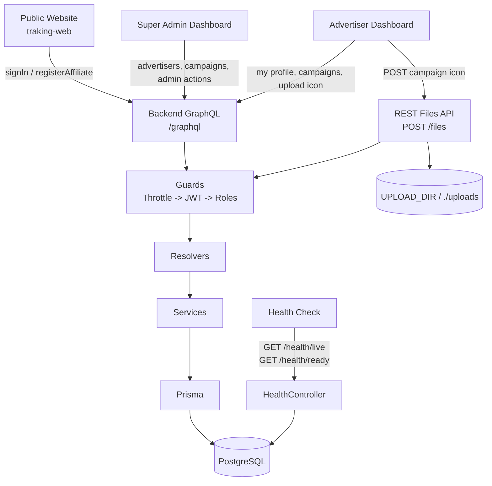

Simple kotha: frontend direct database touch korbe na. Frontend GraphQL/REST call korbe, backend role check korbe, service business logic handle korbe, Prisma database e kaj korbe.

## API Style

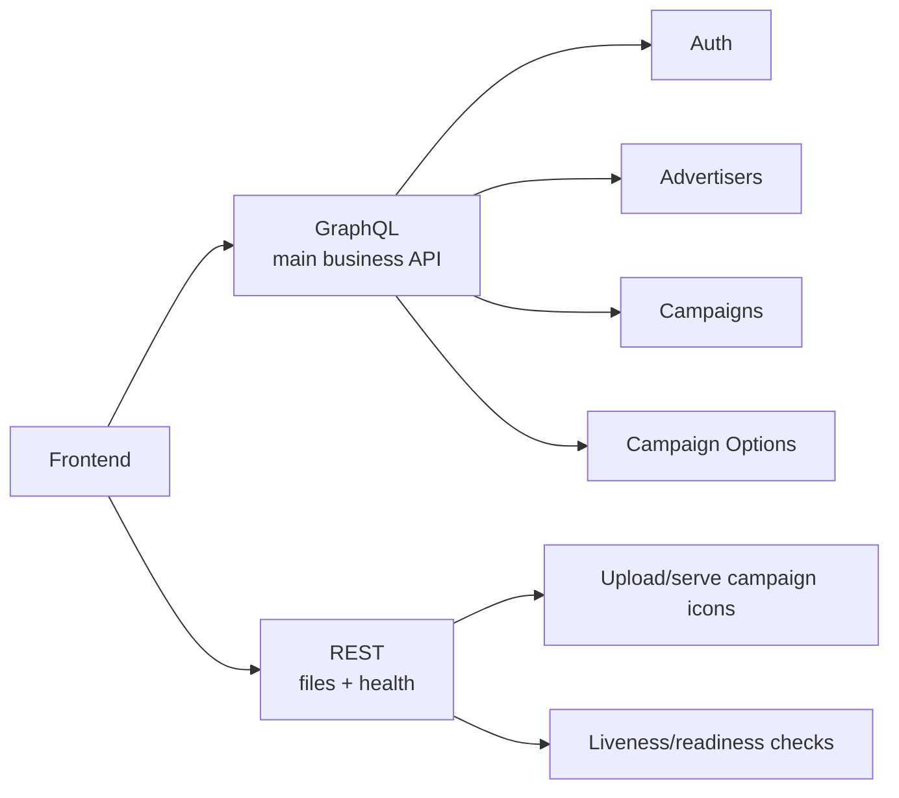

Use GraphQL for:

- login/signup/session
- advertiser list/create/update/delete
- campaign list/create/update/delete/status
- dropdown options for campaign form
- current logged-in user

Use REST for:

- campaign icon/image upload
- public file serving
- infrastructure health checks

## Auth Flow

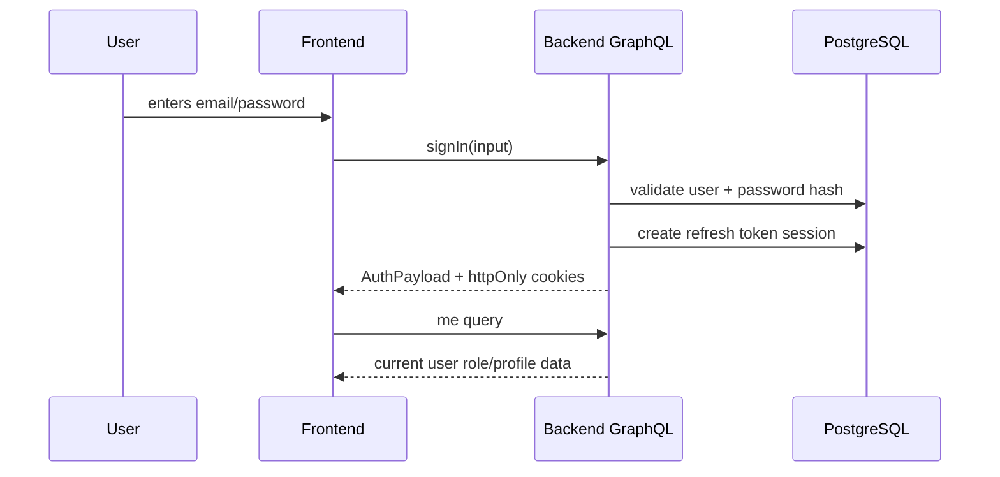

Frontend rule:

- Login er por response e token thakleo browser session mainly httpOnly cookie diye cholbe.
- Apollo/GraphQL client e `credentials: "include"` dite hobe.
- Protected request korar age `me` query diye current user load kora best.

Current auth APIs:

```graphql
mutation SignIn($input: SignInInput!) {
  signIn(input: $input) {
    user {
      id
      email
      role
      firstName
      lastName
    }
  }
}
```

```graphql
mutation RegisterAffiliate($input: RegisterAffiliateInput!) {
  registerAffiliate(input: $input) {
    user {
      id
      email
      role
    }
  }
}
```

```graphql
query Me {
  me {
    id
    email
    role
    isActive
  }
}
```

```graphql
mutation RefreshSession {
  refreshSession {
    expiresIn
    refreshExpiresIn
  }
}
```

```graphql
mutation Logout {
  logout
}
```

## Role Based User Guide

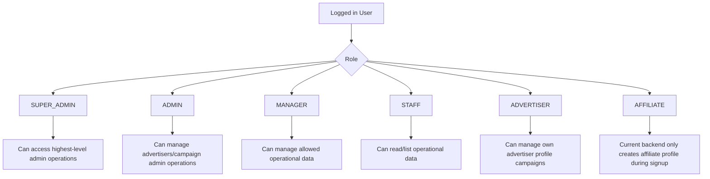

Current practical behavior:

- `SUPER_ADMIN`, `ADMIN`, `MANAGER`, `STAFF` can read advertisers and campaigns list.
- `SUPER_ADMIN`, `ADMIN`, `MANAGER` can create/update advertisers.
- `SUPER_ADMIN`, `ADMIN` can soft-delete advertisers.
- `ADVERTISER` can create/update/toggle/soft-delete own campaigns.
- `ADVERTISER` cannot manage another advertiser's campaign.
- `AFFILIATE` can register, sign in, and has a basic profile, but full affiliate dashboard APIs are future scope.

## Frontend Page To API Map

### Public Site

| Page               | API                    | Current status |
| ------------------ | ---------------------- | -------------- |
| Login              | `signIn`               | Available      |
| Signup / Apply Now | `registerAffiliate`    | Available      |
| Logout             | `logout`               | Available      |
| Session restore    | `me`, `refreshSession` | Available      |

### Super Admin Dashboard

| Page                 | API                               | Current status |
| -------------------- | --------------------------------- | -------------- |
| Advertiser list      | `advertisers`, `advertisersCount` | Available      |
| Advertiser details   | `advertiser(id)`                  | Available      |
| Add advertiser       | `createAdvertiser`                | Available      |
| Edit advertiser      | `updateAdvertiser`                | Available      |
| Disable advertiser   | `softDeleteAdvertiser`            | Available      |
| Campaign list        | `campaigns`, `campaignsCount`     | Available      |
| Campaign details     | `campaign(id)`                    | Available      |
| Affiliate management | Not fully built                   | Future scope   |
| Manager management   | Not built                         | Future scope   |
| Reports              | Not built                         | Future scope   |
| Billing              | Not built                         | Future scope   |
| Notifications        | Not built                         | Future scope   |
| Settings             | Not built                         | Future scope   |

### Advertiser Dashboard

| Page                          | API                        | Current status |
| ----------------------------- | -------------------------- | -------------- |
| My advertiser profile         | `myAdvertiserProfile`      | Available      |
| Campaign options/dropdowns    | `campaignOptions`          | Available      |
| Campaign list                 | `campaigns(my: true)`      | Available      |
| Campaign count                | `campaignsCount(my: true)` | Available      |
| Campaign details              | `campaign(id)`             | Available      |
| Create campaign               | `createCampaign`           | Available      |
| Edit campaign                 | `updateCampaign`           | Available      |
| Toggle campaign active/paused | `toggleCampaignStatus`     | Available      |
| Soft delete campaign          | `softDeleteCampaign`       | Available      |
| Upload campaign icon          | `POST /files`              | Available      |
| Reports                       | Not built                  | Future scope   |
| Notifications                 | Not built                  | Future scope   |
| Settings/password             | Not built                  | Future scope   |

## Advertiser Campaign Flow

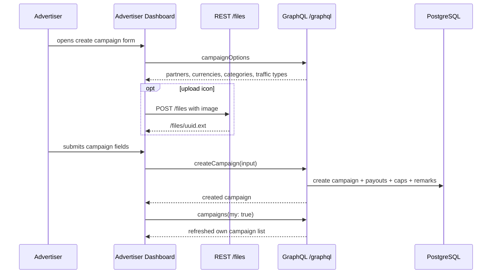

Frontend notes:

- `startDate` and `endDate` are sent as strings.
- `endDate` must be after `startDate`.
- `defaultCost`, `payoutValue`, and `commissionRate` are strings in GraphQL to avoid decimal precision problems.
- Campaign icon should first be uploaded to `/files`; then returned URL should be passed as `icon` in `createCampaign`.

## Main GraphQL Operations

Advertiser list:

```graphql
query Advertisers($filter: AdvertiserFilterInput, $skip: Int!, $take: Int!) {
  advertisers(filter: $filter, skip: $skip, take: $take) {
    id
    companyName
    country
    status
    commissionRate
    referralCode
  }
  advertisersCount(filter: $filter)
}
```

Create advertiser:

```graphql
mutation CreateAdvertiser($input: CreateAdvertiserInput!) {
  createAdvertiser(input: $input) {
    id
    userId
    companyName
    status
  }
}
```

Campaign list:

```graphql
query Campaigns(
  $filter: CampaignFilterInput
  $my: Boolean
  $skip: Int!
  $take: Int!
) {
  campaigns(filter: $filter, my: $my, skip: $skip, take: $take) {
    id
    name
    title
    slug
    category
    status
    defaultCost
    currency
    startDate
    endDate
  }
  campaignsCount(filter: $filter, my: $my)
}
```

Create campaign:

```graphql
mutation CreateCampaign($input: CreateCampaignInput!) {
  createCampaign(input: $input) {
    id
    slug
    name
    status
    payouts {
      id
      payoutType
      payoutValue
      currency
    }
    caps {
      id
      capType
      capLimit
      currentCount
    }
  }
}
```

## File Upload Flow

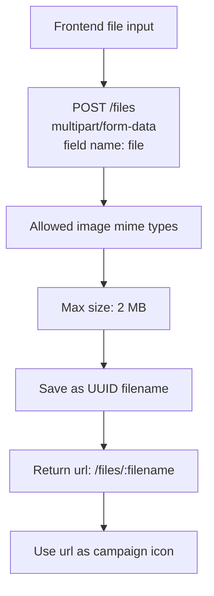

Allowed file types:

- PNG
- JPEG/JPG
- WEBP
- GIF

SVG is intentionally **not** allowed: `GET /files/:name` serves uploads publicly and unauthenticated, and an SVG can carry `<script>`/event-handler payloads — allowing it would be a stored-XSS vector.

## Backend Data Model

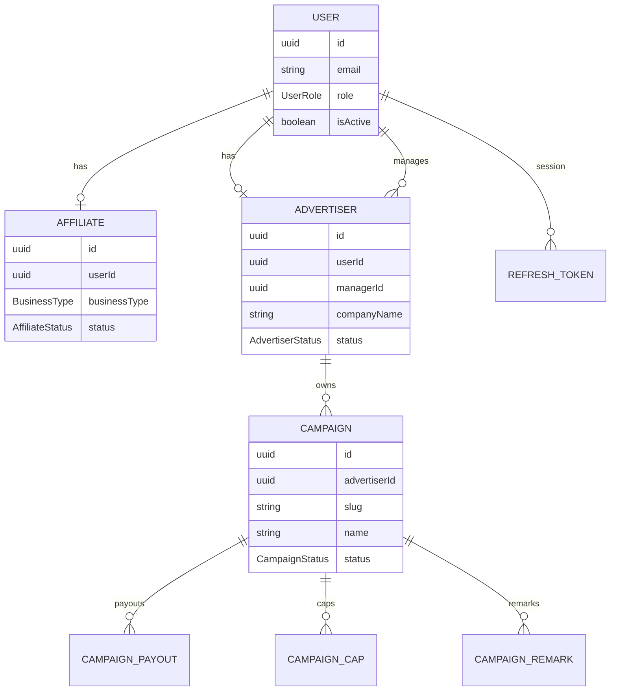

## Phase By Phase Guide

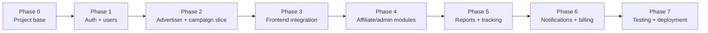

### Phase 0: Project Base

Status: current base exists.

What is already here:

- NestJS app bootstraps from `main.ts`
- Config validation
- GraphQL setup
- Prisma setup
- Logging, helmet, CORS, validation pipe
- Global exception handling and monitoring module

Frontend work:

- Set backend URL in env.
- Configure GraphQL client with credentials included.

Backend work:

- Keep `.env.example` updated.
- Keep migrations clean.

### Phase 1: Auth And User Session

Status: available.

What user can do:

- Affiliate can apply/register.
- Existing user can sign in.
- Browser can keep session through cookies.
- User can logout.
- App can ask `me` to know who is logged in.

Frontend work:

- Build login form around `signIn`.
- Build signup/apply form around `registerAffiliate`.
- On app load, call `me`.
- If `me` fails because session expired, call `refreshSession`, then retry `me`.

Backend work:

- Add password change later.
- Add password reset only when email delivery exists.

### Phase 2: Advertiser And Campaign Slice

Status: current repo has advertiser and campaign modules.

What user can do:

- Admin-side user can create advertiser.
- Admin-side user can list advertisers.
- Advertiser can see own profile.
- Advertiser can create campaign.
- Advertiser can upload campaign icon.
- Advertiser can update/toggle/soft-delete own campaign.

Frontend work:

- Replace advertiser mock data with GraphQL.
- Replace campaign mock data with GraphQL.
- Use `/files` before campaign submit if icon exists.
- Use `campaignOptions` for dropdown values.

Backend work:

- Add tests for advertiser and campaign resolver/service.
- Decide if campaign status needs admin approval transition beyond current fields.

### Phase 3: Real Frontend Integration

Status: next practical work.

Goal:

- One real screen should work from browser to database without mock data.

Recommended first screen:

- Advertiser dashboard campaign list + create campaign.

Why this first:

- It touches auth, role guard, file upload, dropdown options, nested campaign data, and database writes.

Frontend checklist:

- Apollo client configured.
- `credentials: "include"` enabled.
- Login works.
- Create campaign form posts real mutation.
- Campaign list reloads from database.
- File upload URL displays image correctly.

Backend checklist:

- Confirm CORS origin includes frontend URL.
- Confirm cookies work in browser.
- Confirm `ADVERTISER` user has advertiser profile.
- Confirm GraphQL errors are readable for frontend forms.

### Phase 4: Affiliate And Admin Operations

Status: future scope.

Build next:

- Full affiliate list/details/create/update
- Affiliate status approval
- Affiliate groups
- Manager assignment
- Admin-side role and permission model
- Offer management if campaigns and offers must be separate

User guide after this phase:

- Admin can approve/reject affiliates.
- Admin can organize affiliates into groups.
- Manager can see assigned users.
- Staff can view data based on permissions.

### Phase 5: Tracking And Reports

Status: future scope.

Build next:

- Tracking redirect endpoint like `GET /r/:slug`
- Click logging
- Conversion/postback ingest
- Advertiser reports
- Affiliate reports
- Campaign performance reports

Suggested flow:

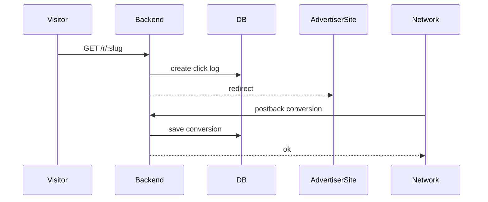

After this phase, dashboards can show real numbers instead of static campaign records.

### Phase 6: Notifications, Billing, Settings

Status: future scope.

Build next:

- Notifications send/list/read
- Billing plans and invoice history
- Support tickets
- Login logs
- Network settings
- Email settings
- Dynamic dropdown settings for categories and traffic types

User guide after this phase:

- Admin can manage platform settings.
- Users can receive notifications.
- Billing screens can show real invoice/payment data.
- Support flow can live inside dashboard.

### Phase 7: Testing And Deployment

Status: future scope.

Build next:

- Unit tests for services
- E2E tests for GraphQL auth/campaign flow
- Dockerfile
- Deployment config
- CI checks for lint/typecheck/test/build

Minimum release checklist:

- `npm run typecheck`
- `npm run lint:check`
- `npm run test`
- `npm run build`
- migration tested on clean database
- frontend login tested in real browser
- cookies tested on production domain setup

## What Not To Confuse

- Current `AFFILIATE` support is registration/basic profile only. Full affiliate dashboard is not built yet.
- Current role guard is fixed role-based. Dynamic Settings role-permission system is future scope.
- Current campaign module exists. Full tracking redirect and conversion reporting are future scope.
- Current file storage is local disk. S3 or cloud object storage is future scope.
- Current health endpoint is available. It is not a user-facing feature.

## Security Rules

Ei part ta important, because frontend e button hide korlei security hoy na. Backend must enforce korte hobe.

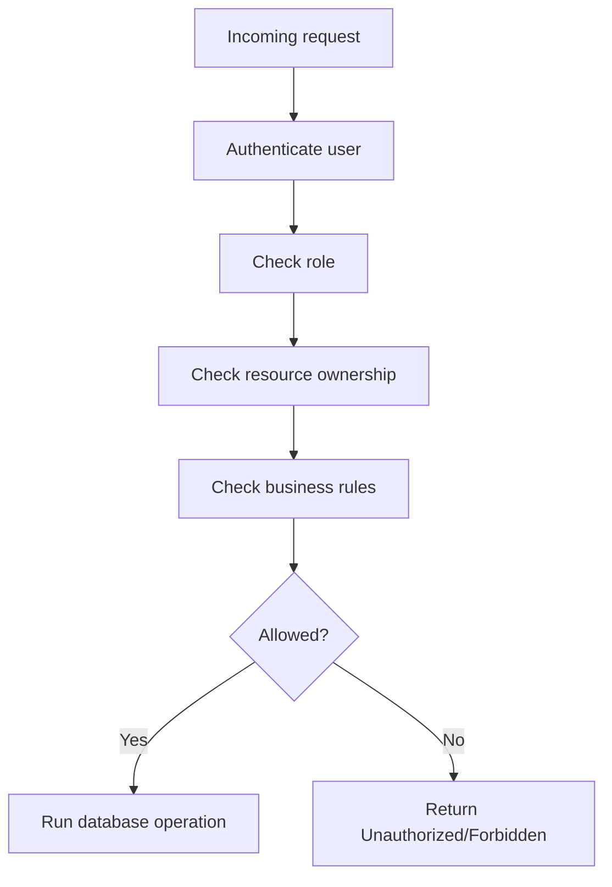

Rules to remember:

- Frontend theke asa `userId`, `role`, `advertiserId`, `managerId`, `status` blindly trust kora jabe na.
- Logged-in user ke backend JWT/cookie session theke identify korte hobe.
- Advertiser nijer campaign chara onno advertiser er campaign read/update/delete korte parbe na.
- Admin actions backend resolver/service level e role-check hote hobe.
- Password field kokhono GraphQL response e expose kora jabe na.
- Refresh token cookie httpOnly thakbe, frontend JavaScript manually read korbe na.
- Production e GraphQL playground/introspection off thaka uchit.

## Frontend Client Setup

Frontend e Apollo/GraphQL client setup korar somoy cookie support must.

```ts
import { ApolloClient, InMemoryCache } from '@apollo/client';

export const client = new ApolloClient({
  uri: `${process.env.NEXT_PUBLIC_API_URL}/graphql`,
  credentials: 'include',
  cache: new InMemoryCache(),
});
```

Main point:

- `credentials: "include"` na dile browser httpOnly auth cookies backend e pathabe na.
- Backend CORS e frontend domain thakte hobe.
- Login er por app reload hole `me` query diye session restore korte hobe.
- `UNAUTHORIZED` pele first try can be `refreshSession`, then retry `me`.
- Refresh fail korle user ke login page e pathano clean.

## Error Handling Guide

Frontend form and page state handle korar jonno ei table follow kora jay.

| Error          | Meaning                                           | Frontend action                    |
| -------------- | ------------------------------------------------- | ---------------------------------- |
| `UNAUTHORIZED` | User logged in na, token invalid, session expired | Try refresh, otherwise login page  |
| `FORBIDDEN`    | User logged in but permission nai                 | Show no-access message             |
| `CONFLICT`     | Duplicate email/referral/unique field             | Show field-level form error        |
| `BAD_REQUEST`  | Invalid input or business rule failed             | Show validation error              |
| `NOT_FOUND`    | Resource missing or unavailable                   | Show not-found/empty state         |
| Server error   | Backend unexpected failure                        | Show general error and log details |

Frontend should not show raw stack trace. User-friendly message show korbe, developer console/logging e technical detail rakha jay.

## Pagination And Filtering

Current list APIs `skip`, `take`, and optional `filter` use kore.

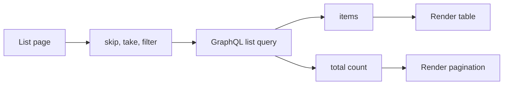

Current API pattern:

- `advertisers(filter, skip, take)`
- `advertisersCount(filter)`
- `campaigns(filter, my, skip, take)`
- `campaignsCount(filter, my)`

Frontend rule:

- Default page size 20 rakha safe.
- Search input debounce kore API call kora better.
- Very large `take` request kora uchit na.
- `my: true` advertiser dashboard e use korle user scoped campaign list pabe.

## Local Development Setup

New developer local e run korte chaile:

```bash
npm install
```

```bash
cp .env.example .env.local
```

Then `.env.local` e database URL, JWT secret, frontend URL set korte hobe.

```bash
npm run migration:run
npm run seed:run
npm run start:dev
```

Useful commands:

```bash
npm run typecheck
npm run lint:check
npm run test
npm run build
npm run prisma:studio
```

## Current Vs Future Scope

| Area          | Current                                                   | Future scope                                                             |
| ------------- | --------------------------------------------------------- | ------------------------------------------------------------------------ |
| Auth          | Login, affiliate register, refresh, logout, `me`          | Password change, password reset, email verification                      |
| Users         | Basic user entity and credential handling                 | Admin user management and richer profile settings                        |
| Affiliates    | Signup creates basic affiliate profile                    | Full affiliate dashboard, approval, groups, payments, reports            |
| Advertisers   | Admin create/list/update/disable advertiser               | Approval workflow, richer manager assignment, advertiser reports         |
| Campaigns     | Advertiser create/list/update/toggle/soft-delete campaign | Admin approval workflow, tracking redirect, conversion reporting         |
| Files         | Local image upload and public file serve                  | S3/cloud storage, image optimization, cleanup jobs                       |
| Reports       | Not built                                                 | Clicks, conversions, revenue, affiliate/advertiser/campaign reports      |
| Notifications | Not built                                                 | Send/list/read notifications                                             |
| Billing       | Not built                                                 | Plans, invoices, payments, history                                       |
| Settings      | Static campaign options in code                           | Dynamic categories, traffic types, roles, permissions, platform settings |
| Testing       | Basic test structure exists                               | Full service/unit/e2e coverage                                           |
| Deployment    | App can run locally                                       | Docker, CI/CD, production infra, managed Postgres                        |

## Manual QA Checklist

Before saying a frontend-backend slice is done, manually check:

- Valid user can sign in.
- Wrong password is rejected.
- `me` works after login.
- `logout` clears session.
- Expired session can call `refreshSession`.
- Advertiser can load own profile.
- Advertiser can create campaign.
- Advertiser can see only own campaign in advertiser dashboard.
- Advertiser cannot update/delete another advertiser's campaign.
- Admin can list advertisers.
- Admin can create advertiser.
- File upload accepts allowed image type.
- File upload rejects unsupported file type.
- File upload rejects file bigger than 2 MB.
- `/health/live` returns ok without DB.
- `/health/ready` checks DB connection.

## Deployment Notes

Production e kichu jinis miss korle app locally kaj korleo live e pain dibe.

- `FRONTEND_URL` e shob frontend domain add korte hobe.
- Cookie settings production domain er sathe match korte hobe.
- JWT secrets strong and private hote hobe.
- `.env.local` production e use kora jabe na; production env separate.
- GraphQL playground/introspection production e off thaka uchit.
- Upload directory persistent na hole deploy/restart e files harate pare.
- Real production e file storage S3-compatible storage e move kora better.
- Database migration deploy er age tested thaka uchit.
- Logs e password/token/cookie leak hocche kina check korte hobe.

## Practical Next Step

The cleanest next step is to connect one frontend screen end-to-end:

1. Login as advertiser.
2. Load `myAdvertiserProfile`.
3. Load `campaignOptions`.
4. Create a campaign.
5. Show `campaigns(my: true)` from database.
6. Upload and display a campaign icon with `/files`.

Once that works in the browser, then scale the same pattern across admin screens.
