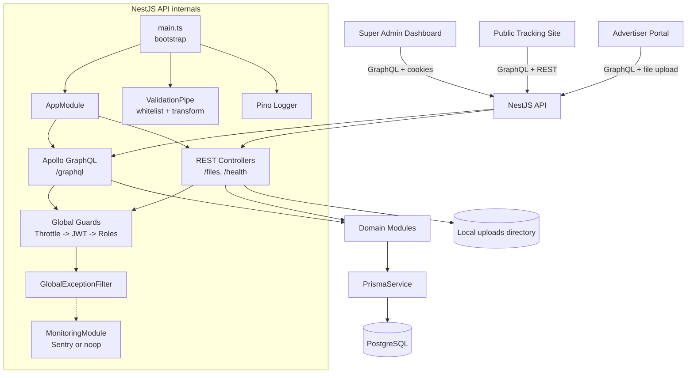
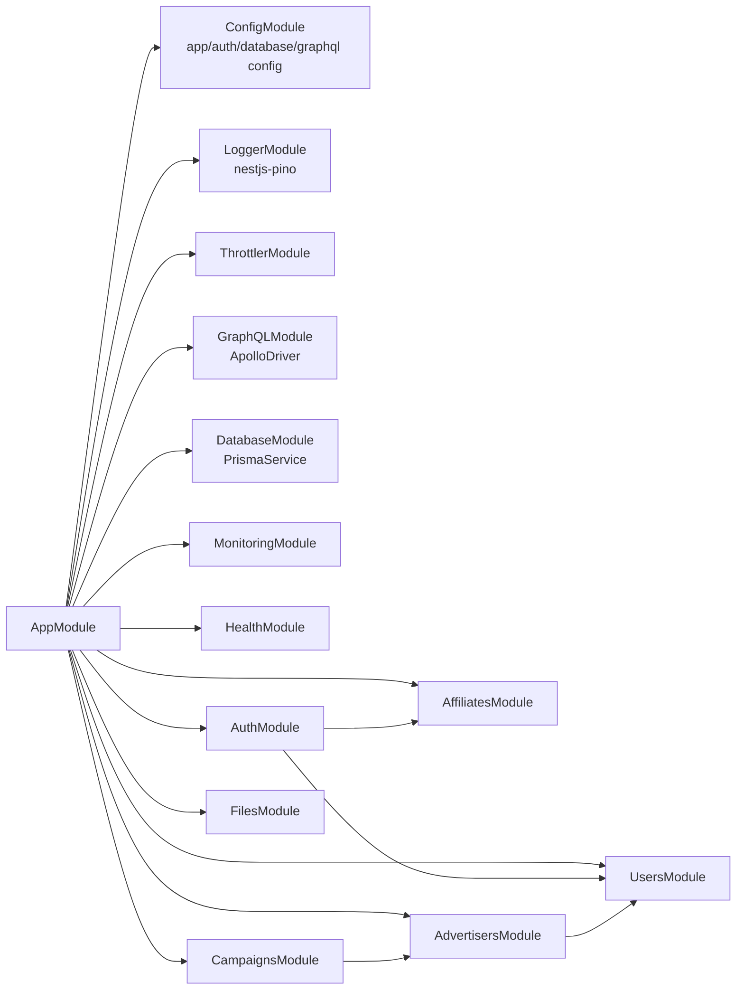
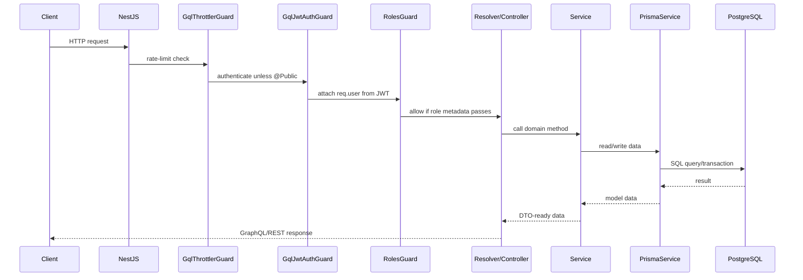
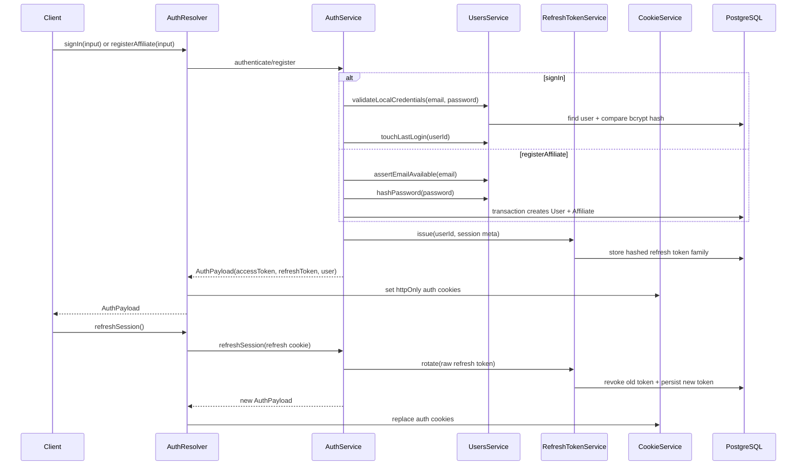
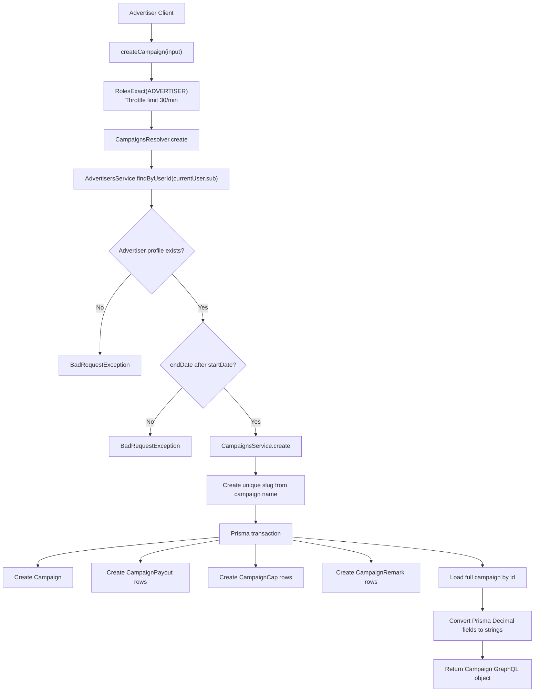
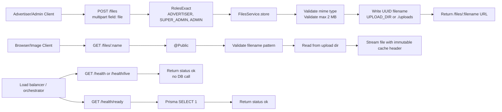
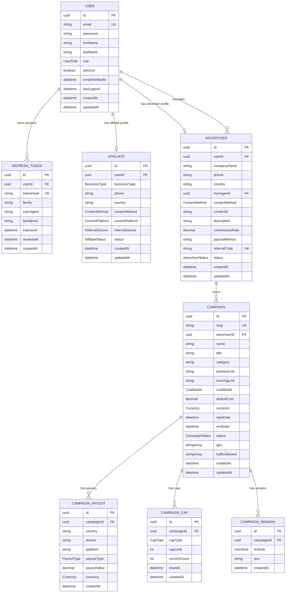

# Tracking Backend Graphs

This document summarizes the current `tracking-backend` project using Mermaid graphs. It reflects the NestJS, GraphQL, REST, Prisma, PostgreSQL, auth, advertiser, campaign, file, and health-check code currently present in the repository.

## System Architecture

## Module Dependency Graph

## Request Pipeline

## Authentication And Session Flow

## Domain Flow: Advertiser Creates Campaign

## REST Endpoints

## Prisma Entity Relationship Graph

## Resolver Surface

```mermaid
flowchart TB
    GraphQL["GraphQL API"]

    GraphQL --> AuthResolver["AuthResolver"]
    AuthResolver --> Register["registerAffiliate"]
    AuthResolver --> SignIn["signIn"]
    AuthResolver --> Refresh["refreshSession"]
    AuthResolver --> Logout["logout"]
    AuthResolver --> Me["me"]

    GraphQL --> AdvertisersResolver["AdvertisersResolver"]
    AdvertisersResolver --> AdvertisersList["advertisers"]
    AdvertisersResolver --> AdvertisersCount["advertisersCount"]
    AdvertisersResolver --> AdvertiserById["advertiser(id)"]
    AdvertisersResolver --> MyAdvertiser["myAdvertiserProfile"]
    AdvertisersResolver --> CreateAdvertiser["createAdvertiser"]
    AdvertisersResolver --> UpdateAdvertiser["updateAdvertiser"]
    AdvertisersResolver --> DeleteAdvertiser["softDeleteAdvertiser"]

    GraphQL --> CampaignsResolver["CampaignsResolver"]
    CampaignsResolver --> CampaignsList["campaigns"]
    CampaignsResolver --> CampaignsCount["campaignsCount"]
    CampaignsResolver --> CampaignById["campaign(id)"]
    CampaignsResolver --> CreateCampaign["createCampaign"]
    CampaignsResolver --> UpdateCampaign["updateCampaign"]
    CampaignsResolver --> ToggleCampaign["toggleCampaignStatus"]
    CampaignsResolver --> DeleteCampaign["softDeleteCampaign"]

    GraphQL --> CampaignOptionsResolver["CampaignOptionsResolver"]
    CampaignOptionsResolver --> CampaignOptions["campaignOptions"]
```

