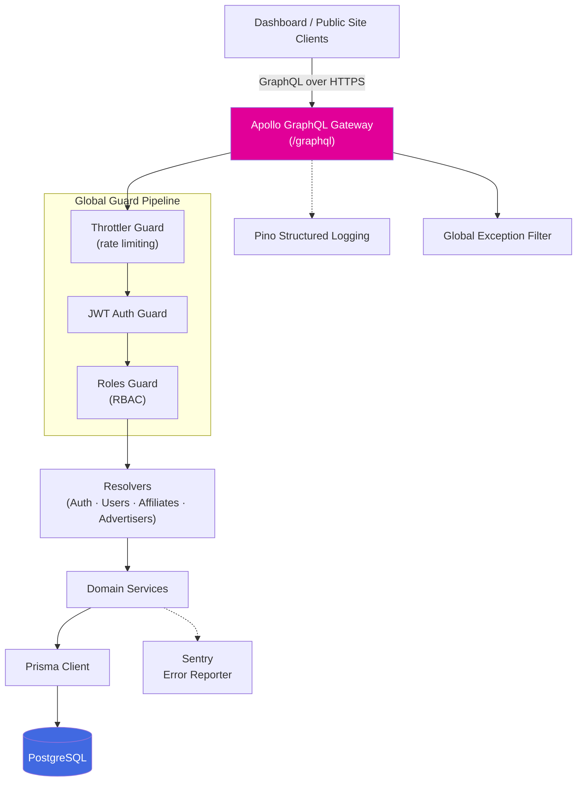
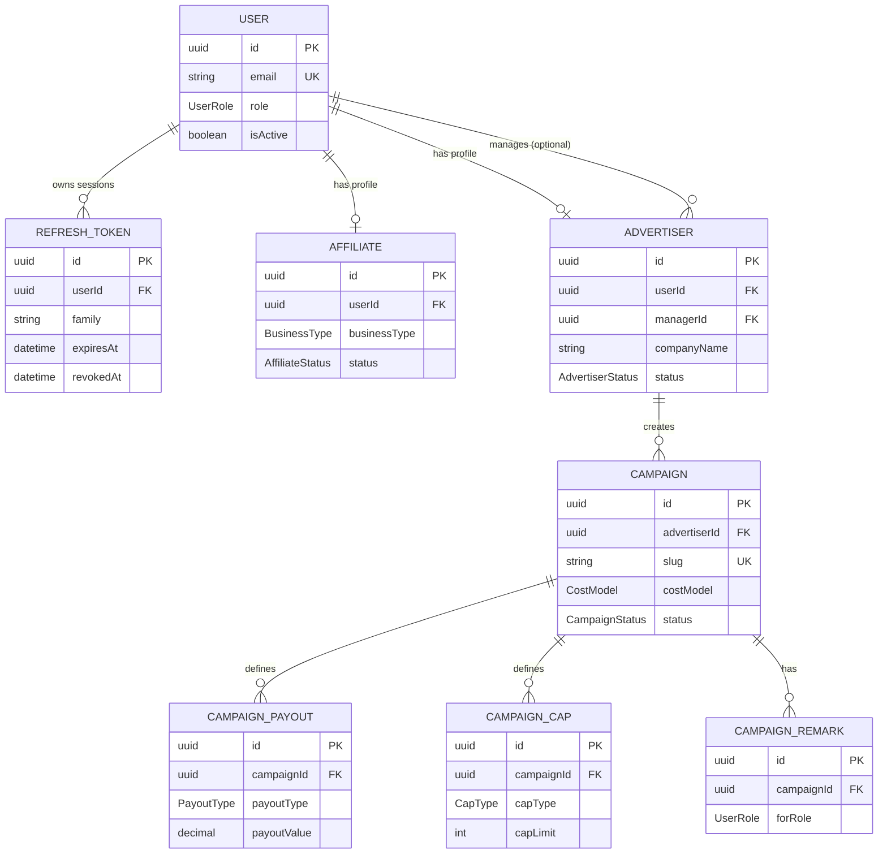

# Tracking Backend


GraphQL API powering the **Tracking** affiliate marketing platform — affiliate & advertiser onboarding, campaign management, and role-based access for the super-admin dashboard and public tracking site.

## Table of Contents

- [Overview](#overview)
- [Tech Stack](#tech-stack)
- [Architecture](#architecture)
- [Data Model](#data-model)
- [Project Structure](#project-structure)
- [Getting Started](#getting-started)
- [Environment Variables](#environment-variables)
- [Available Scripts](#available-scripts)
- [Authentication & Authorization](#authentication--authorization)
- [Code Quality & Git Hooks](#code-quality--git-hooks)
- [License](#license)

## Overview

`tracking-backend` is a NestJS + GraphQL API backed by PostgreSQL/Prisma. It serves two frontends in the `tracking/` workspace — the internal super-admin dashboard and the public-facing tracking site — replacing their mock data with a real, authenticated data layer.

## Tech Stack

| Layer          | Technology                                                        |
| -------------- | ----------------------------------------------------------------- |
| Framework      | [NestJS 11](https://nestjs.com/)                                  |
| API            | GraphQL (code-first) via `@nestjs/graphql` + Apollo               |
| Database       | PostgreSQL                                                        |
| ORM            | [Prisma](https://www.prisma.io/)                                  |
| Auth           | JWT (access + refresh) via `@nestjs/jwt` + `passport-jwt`, bcrypt |
| Validation     | class-validator / class-transformer                               |
| Logging        | Pino (`nestjs-pino`)                                              |
| Error tracking | Sentry                                                            |
| Security       | Helmet, `@nestjs/throttler` rate limiting                         |
| Testing        | Jest, Supertest, Testcontainers (Postgres)                        |
| Tooling        | ESLint, Prettier, Husky, commitlint, lint-staged                  |

## Architecture

Every request passes through a fixed guard pipeline before reaching a resolver, and every resolver delegates persistence to Prisma:



## Data Model

Core entities and relationships as defined in [`prisma/schema.prisma`](prisma/schema.prisma):



## Project Structure

```
tracking-backend/
├── prisma/
│   ├── schema.prisma          # Data model (source of truth for the DB)
│   └── migrations/            # Versioned SQL migrations
├── src/
│   ├── common/                 # Cross-cutting: guards, filters, decorators, pagination, monitoring
│   ├── config/                 # Env loading, validation, typed config namespaces
│   ├── database/                # PrismaService, DatabaseModule, seed runner
│   ├── modules/
│   │   ├── auth/                # JWT strategy, cookie-based sessions, refresh rotation
│   │   ├── users/                # User lookups & credential handling
│   │   ├── affiliates/           # Affiliate profiles
│   │   └── advertisers/          # Advertiser profiles & campaign ownership
│   ├── app.module.ts
│   ├── main.ts
│   └── schema.gql               # Auto-generated GraphQL schema (code-first)
└── test/                        # e2e tests
```

## Getting Started

### Prerequisites

- Node.js ≥ 20
- PostgreSQL ≥ 15
- npm

### Installation

```bash
npm install
```

### Configure environment

Copy the template and fill in real values (see [Environment Variables](#environment-variables)):

```bash
cp .env.example .env.local
```

### Set up the database

```bash
npm run migration:run   # apply migrations
npm run seed:run        # seed a super-admin user (reads ADMIN_EMAIL / ADMIN_PASSWORD)

# or both in one step
npm run db:setup
```

### Run the app

```bash
npm run start:dev
```

The GraphQL endpoint is served at `http://localhost:3000/graphql` (playground enabled outside production).

## Environment Variables

| Variable                                        | Description                                               |
| ----------------------------------------------- | --------------------------------------------------------- |
| `PORT`                                          | HTTP port the server listens on                           |
| `NODE_ENV`                                      | `development` \| `production`                             |
| `FRONTEND_URL`                                  | Comma-separated CORS allow-list (dashboard + public site) |
| `GRAPHQL_PATH`                                  | GraphQL endpoint path                                     |
| `GRAPHQL_INTROSPECTION`                         | Enable schema introspection                               |
| `DATABASE_URL`                                  | PostgreSQL connection string                              |
| `JWT_SECRET` / `JWT_EXPIRES_IN`                 | Access token signing secret & TTL                         |
| `JWT_REFRESH_SECRET` / `JWT_REFRESH_EXPIRES_IN` | Refresh token signing secret & TTL                        |
| `THROTTLE_TTL` / `THROTTLE_LIMIT`               | Rate limiting window & max requests                       |

Full reference: [`.env.example`](.env.example). Production refuses to boot with placeholder secrets.

## Available Scripts

| Command                       | Purpose                                   |
| ----------------------------- | ----------------------------------------- |
| `npm run start:dev`           | Run in watch mode                         |
| `npm run build`               | Type-check, generate Prisma client, build |
| `npm run start:prod`          | Run the production build                  |
| `npm run lint` / `lint:check` | Lint (autofix / check-only)               |
| `npm run typecheck`           | TypeScript type-check, no emit            |
| `npm run test` / `test:cov`   | Unit tests / with coverage                |
| `npm run test:e2e`            | End-to-end tests                          |
| `npm run migration:dev`       | Create & apply a dev migration            |
| `npm run migration:run`       | Apply pending migrations                  |
| `npm run seed:run`            | Run database seeders                      |
| `npm run prisma:studio`       | Open Prisma Studio                        |

## Authentication & Authorization

- **Sessions:** JWT access token + rotating refresh token, delivered as httpOnly cookies (`cookie.service.ts`). Refresh tokens are DB-backed with family-based rotation — reuse of a revoked token revokes the entire family.
- **Guard pipeline (global, in order):** rate limiting → JWT authentication → role-based authorization.
- **Roles:** `SUPER_ADMIN`, `ADMIN`, `MANAGER`, `STAFF`, `AFFILIATE`, `ADVERTISER`, enforced by `RolesGuard` with a fixed rank hierarchy.

## Code Quality & Git Hooks

Enforced via Husky:

- **pre-commit** → `lint-staged` (ESLint + Prettier on staged files)
- **commit-msg** → `commitlint` ([Conventional Commits](https://www.conventionalcommits.org/))
- **pre-push** → `typecheck` + `test`

## License

Private / Unlicensed — internal project, not for redistribution.
