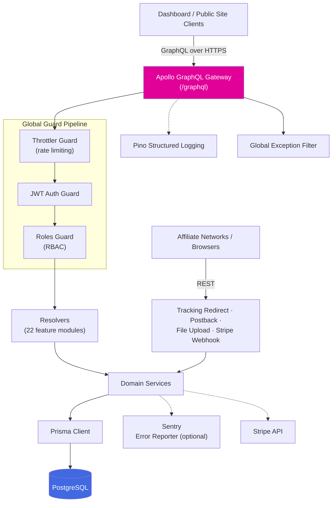
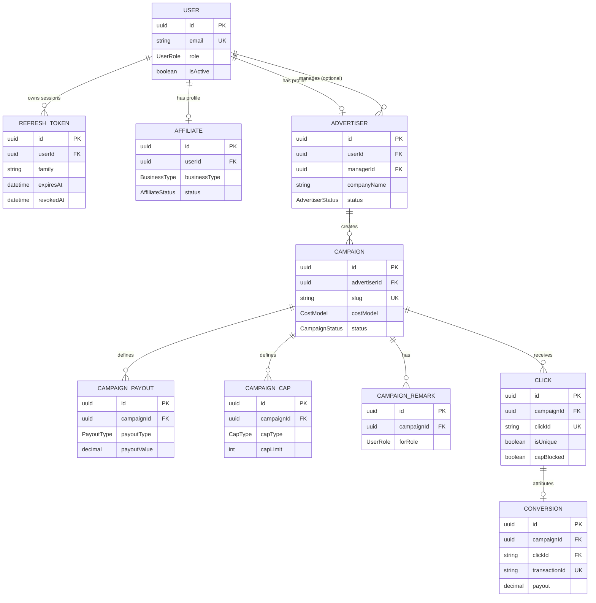

# Tracking Backend


GraphQL + REST API powering the **Tracking** affiliate marketing platform — affiliate & advertiser onboarding, campaign/offer management, click & conversion tracking, billing, support, and role-based access for the super-admin dashboard and public tracking site.

## Table of Contents

- [Overview](#overview)
- [Tech Stack](#tech-stack)
- [Architecture](#architecture)
- [Feature Modules](#feature-modules)
- [Data Model](#data-model)
- [Project Structure](#project-structure)
- [Getting Started](#getting-started)
- [Running with Docker](#running-with-docker)
- [Environment Variables](#environment-variables)
- [Available Scripts](#available-scripts)
- [Authentication & Authorization](#authentication--authorization)
- [Code Quality & Git Hooks](#code-quality--git-hooks)
- [Project Health](#project-health)
- [License](#license)

## Overview

`tracking-backend` is a NestJS + GraphQL API backed by PostgreSQL/Prisma. It serves the frontends in the `tracking/` workspace — the internal super-admin dashboard, the advertiser self-service dashboard, and the public-facing marketing/tracking site — with a real, authenticated data layer covering the full affiliate-marketing lifecycle: onboarding, campaigns and offers, click/conversion tracking, payouts, billing, and support.

## Tech Stack

| Layer          | Technology                                                                                                                                    |
| -------------- | --------------------------------------------------------------------------------------------------------------------------------------------- |
| Framework      | [NestJS 11](https://nestjs.com/)                                                                                                              |
| API            | GraphQL (code-first) via `@nestjs/graphql` + Apollo, plus a small REST surface (tracking redirect, S2S postback, file upload, Stripe webhook) |
| Database       | PostgreSQL                                                                                                                                    |
| ORM            | [Prisma](https://www.prisma.io/)                                                                                                              |
| Auth           | JWT (access + refresh) via `@nestjs/jwt` + `passport-jwt`, bcrypt                                                                             |
| Billing        | [Stripe](https://stripe.com/) (subscriptions, invoices, webhook sync)                                                                         |
| Validation     | class-validator / class-transformer                                                                                                           |
| Logging        | Pino (`nestjs-pino`)                                                                                                                          |
| Error tracking | Sentry (optional — no-op until `SENTRY_DSN` is set)                                                                                           |
| Security       | Helmet, `@nestjs/throttler` rate limiting, GraphQL depth/field-count limits                                                                   |
| Testing        | Jest, Supertest, Testcontainers (real ephemeral Postgres for integration tests)                                                               |
| Deployment     | Docker (multi-stage build), Docker Compose (app + Postgres)                                                                                   |
| Tooling        | ESLint, Prettier, Husky, commitlint, lint-staged                                                                                              |

## Architecture

Every request passes through a fixed guard pipeline before reaching a resolver, and every resolver delegates persistence to Prisma:



`@Public()` opts a handler out of the JWT/roles guards (used for `/health`, sign-in/register, the tracking redirect, the Stripe webhook, and public content like FAQs/pricing). Everything else requires a valid access token by default.

## Feature Modules

`src/modules/` — grouped by domain:

| Domain                 | Modules                                                                                                                        | What they cover                                                                                                               |
| ---------------------- | ------------------------------------------------------------------------------------------------------------------------------ | ----------------------------------------------------------------------------------------------------------------------------- |
| Identity & Access      | `auth`, `users`, `affiliates`, `affiliate-groups`, `affiliate-payments`, `referral-programs`, `role-permissions`, `login-logs` | Sign-in/registration, JWT refresh rotation, affiliate profiles & cohorts, payout terms, referral tracking, login audit trail  |
| Advertiser & Campaign  | `advertisers`, `campaigns`, `offers`, `cr-optimizer`                                                                           | Advertiser accounts, campaign lifecycle (payouts/caps/remarks), advertiser-owned offers, conversion-rate experiments          |
| Tracking & Attribution | `tracking`                                                                                                                     | Click redirect (`GET /r/:slug`) + cookie drop, S2S postback ingest (`POST /postback/:campaignId`, HMAC-verified, idempotent)  |
| Reporting & Analytics  | `reports`                                                                                                                      | Admin dashboards (offers/affiliates/advertisers/conversions/clicks/postback-logs/fraud) plus overview & performance analytics |
| Commerce               | `billing`                                                                                                                      | Plans, subscriptions, invoices, payment methods, Stripe webhook sync (`POST /stripe/webhook`)                                 |
| Engagement & Support   | `notifications`, `faqs`, `support-tickets`, `signup-questions`, `settings`                                                     | In-app notifications, FAQ content, support tickets, custom signup fields, key/value config store                              |
| Platform               | `files`, `health`                                                                                                              | File upload/serving (`POST /files`, `GET /files/:name`), liveness/readiness probes                                            |

For a detailed capability inventory (per-module purpose, API surface, and known gaps), see [Project Health](#project-health).

## Data Model

Core entities and relationships as defined in [`prisma/schema.prisma`](prisma/schema.prisma):



35 Prisma models in total across identity, affiliate, advertiser/campaign, offer, tracking, engagement, billing, and platform domains. This diagram covers the core attribution chain only — full detail lives in [`prisma/schema.prisma`](prisma/schema.prisma) and [`DATABASE-UML-DIAGRAM.md`](DATABASE-UML-DIAGRAM.md).

## Project Structure

```
tracking-backend/
├── prisma/
│   ├── schema.prisma           # Data model (source of truth for the DB)
│   └── migrations/             # Versioned SQL migrations
├── src/
│   ├── common/                  # Cross-cutting: guards, filters, decorators, pagination, monitoring, GraphQL scalars
│   ├── config/                  # Env loading, validation, typed config namespaces
│   ├── database/                 # PrismaService, DatabaseModule, seed runner
│   ├── modules/                  # 22 feature modules — see Feature Modules above
│   ├── app.module.ts
│   ├── main.ts
│   └── schema.gql                # Auto-generated GraphQL schema (code-first; regenerated on boot in dev)
├── test/                         # e2e + integration tests (Testcontainers)
├── Dockerfile                    # Multi-stage production build
├── docker-compose.yml            # App + Postgres, for local/demo deployment
├── CURRENT-SCOPE.md               # Living capability inventory (see Project Health)
└── GAP-ANALYSIS.md                # Living issue tracker (see Project Health)
```

## Getting Started

### Prerequisites

- Node.js ≥ 20
- PostgreSQL ≥ 15
- npm

### Installation

```bash
npm install
```

### Configure environment

Copy the template and fill in real values (see [Environment Variables](#environment-variables)):

```bash
cp .env.example .env.local
```

### Set up the database

```bash
npm run migration:run   # apply migrations
npm run seed:run        # seed a super-admin user (reads ADMIN_EMAIL / ADMIN_PASSWORD)

# or both in one step
npm run db:setup
```

### Run the app

```bash
npm run start:dev
```

The GraphQL endpoint is served at `http://<BIND_HOST>:<PORT>/graphql` (playground enabled outside production) — `BIND_HOST` defaults to `127.0.0.1` and `PORT` defaults to `3000` unless overridden in `.env.local` (this repo's own local dev convention uses `PORT=7000`; check your `.env.local`).

## Running with Docker

A multi-stage `Dockerfile` and a `docker-compose.yml` (app + Postgres) are included for local or demo deployment:

```bash
docker compose up -d --build
```

This builds the production image, starts Postgres with a health check, runs `prisma migrate deploy`, and starts the app once Postgres is ready. Override the generated secrets before doing anything beyond a local smoke test:

```bash
JWT_SECRET=$(openssl rand -hex 32) \
JWT_REFRESH_SECRET=$(openssl rand -hex 32) \
POSTBACK_SECRET=$(openssl rand -hex 32) \
docker compose up -d --build
```

The app **refuses to boot in production** if `JWT_SECRET` still looks like a placeholder (`change-me`, `replace-with`, `example`, etc.) — this is intentional (see `src/config/env.validation.ts`). Billing (Stripe) is optional: if `STRIPE_SECRET_KEY`/`STRIPE_WEBHOOK_SECRET` are unset, the app boots normally and only `POST /stripe/webhook` responds 503, matching how Sentry (`SENTRY_DSN`) is handled elsewhere.

```bash
docker compose logs -f backend   # tail logs
docker compose down              # stop (add -v to also drop the postgres_data volume)
```

## Environment Variables

| Variable                                        | Required | Description                                                                       |
| ----------------------------------------------- | -------- | --------------------------------------------------------------------------------- |
| `PORT`                                          | ✅       | HTTP port the server listens on                                                   |
| `BIND_HOST`                                     |          | Bind address (default `127.0.0.1`; use `0.0.0.0` only behind a reverse proxy)     |
| `NODE_ENV`                                      |          | `development` \| `production` \| `test`                                           |
| `APP_NAME`                                      | ✅       | Display name, used in logs                                                        |
| `FRONTEND_URL`                                  | ✅       | Comma-separated CORS allow-list (every browser client — dashboards + public site) |
| `GRAPHQL_PATH`                                  | ✅       | GraphQL endpoint path                                                             |
| `GRAPHQL_INTROSPECTION`                         |          | Enable schema introspection (hard-off in production regardless of this)           |
| `DATABASE_URL`                                  | ✅       | PostgreSQL connection string (set `?connection_limit=N` explicitly)               |
| `JWT_SECRET` / `JWT_EXPIRES_IN`                 | ✅       | Access token signing secret & TTL                                                 |
| `JWT_REFRESH_SECRET` / `JWT_REFRESH_EXPIRES_IN` |          | Refresh session config & TTL                                                      |
| `COOKIE_DOMAIN`                                 |          | Domain the auth cookies are scoped to                                             |
| `THROTTLE_TTL` / `THROTTLE_LIMIT`               | ✅       | Rate limiting window & max requests                                               |
| `ADMIN_EMAIL` / `ADMIN_PASSWORD`                |          | Seeds a super-admin on boot if both are set (silently skipped otherwise)          |
| `SEED_SAMPLE`                                   |          | Also seed a sample manager/advertiser/campaign for local dev                      |
| `POSTBACK_SECRET`                               |          | HMAC-SHA256 secret the affiliate network signs S2S postbacks with                 |
| `MAX_CLICK_AGE_HOURS`                           |          | Reject a postback whose click is older than this (default 720h / 30d)             |
| `UPLOAD_DIR`                                    |          | Local disk path for file uploads (default `./uploads`)                            |
| `STRIPE_SECRET_KEY` / `STRIPE_WEBHOOK_SECRET`   |          | Enables billing; unset = webhook returns 503, rest of the app is unaffected       |
| `SENTRY_DSN`                                    |          | Enables crash reporting; unset = no-op                                            |

Full reference with defaults: [`.env.example`](.env.example). Production refuses to boot with placeholder secrets or missing required (✅) variables.

## Available Scripts

| Command                       | Purpose                                                                                |
| ----------------------------- | -------------------------------------------------------------------------------------- |
| `npm run start:dev`           | Run in watch mode                                                                      |
| `npm run build`               | Type-check, generate Prisma client, build                                              |
| `npm run start:prod`          | Run the production build                                                               |
| `npm run lint` / `lint:check` | Lint (autofix / check-only)                                                            |
| `npm run typecheck`           | TypeScript type-check, no emit                                                         |
| `npm run test` / `test:cov`   | Unit tests / with coverage                                                             |
| `npm run test:e2e`            | End-to-end tests                                                                       |
| `npm run test:integration`    | Integration tests against a real ephemeral Postgres (Testcontainers — requires Docker) |
| `npm run migration:dev`       | Create & apply a dev migration                                                         |
| `npm run migration:run`       | Apply pending migrations                                                               |
| `npm run seed:run`            | Run database seeders                                                                   |
| `npm run prisma:studio`       | Open Prisma Studio                                                                     |

## Authentication & Authorization

- **Sessions:** JWT access token + rotating refresh token, delivered as httpOnly cookies (`cookie.service.ts`). Refresh tokens are DB-backed with family-based rotation — reuse of a revoked token revokes the entire family (stolen-token defense). Every login attempt (success and failure) is recorded via `login-logs`.
- **Guard pipeline (global, in order):** rate limiting → JWT authentication → role-based authorization. A handler marked `@Public()` skips authentication (still rate-limited).
- **Roles:** `SUPER_ADMIN`, `ADMIN`, `MANAGER`, `STAFF`, `AFFILIATE`, `ADVERTISER`. Staff roles are hierarchical via `@Roles(...)` (STAFF ≤ MANAGER ≤ ADMIN ≤ SUPER_ADMIN); `AFFILIATE`/`ADVERTISER` are peer tracks gated with `@RolesExact(...)` so one can never inherit the other's or staff's access via rank.

## Code Quality & Git Hooks

Enforced via Husky:

- **pre-commit** → `lint-staged` (ESLint + Prettier on staged files)
- **commit-msg** → `commitlint` ([Conventional Commits](https://www.conventionalcommits.org/))
- **pre-push** → `typecheck` + `test`

## Project Health

This repo maintains two living review documents alongside the code:

- [`CURRENT-SCOPE.md`](CURRENT-SCOPE.md) — a capability inventory: what each module does, its API surface, and its functional status.
- [`GAP-ANALYSIS.md`](GAP-ANALYSIS.md) — every known issue as a discrete, severity-rated entry (`GAP-xxx`) with evidence, impact, and a recommended fix, so any of them can be promoted straight to an issue tracker.

Both are updated as issues are found and fixed — check them before assuming a described gap is still open.

## License

Private / Unlicensed — internal project, not for redistribution.
